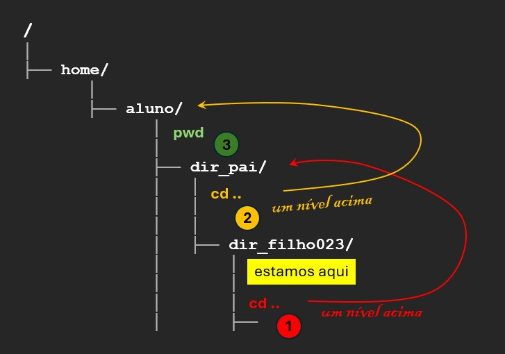

## Navegando pelo sistema
Já sabemos o que há dentro de `dir_pai`{{}}. Vamos até lá agora. Para mudar de diretório, precisamos usar o comando `cd`{{}} (_**C**hange **D**irectory_).

>**Sintaxe:**
>chdir DIRECTORY...
> - DIRECTORY: nome do diretório.

`cd dir_pai`{{exec}}

`ls`{{exec}}

Para saber em que diretótio estamos, usamos o comando `pwd`{{}} (_**P**rint **W**orking **D**irectory_).

>**Sintaxe:**
>pwd [OPTION]...
> - OPTION: opções do comando (opcional).

`pwd`{{exec}}

Esse comando mostra seu diretório de trabalho atual.

Podemos voltar ao diretório anterior digitando:

`cd ..`{{exec}}

>Nota. Lembre-se que o comando `cd ..` nos leva ao **diretório pai** daquele (imediatamente anterior àquele) em que estamos.

Tabém é valido dizer que `cd ..` nos leva à **um nível acima** na cadeia de diretórios.

Ok, onde estamos agora?

`pwd`{{exec}}

Vamos nos mover para um diretório mais profundo.

`cd dir_pai/dir_filho023`{{exec}}

Onde estamos agora?

`pwd`{{}}

Como você pode ver, podemos navegar por vários diretórios, fornecendo-os com `/`{{}} como separador.

Como isso funciona? Será explicado na próxima página.

Se quisermos voltar ao diretório inicial (aquele de onde começamos), podemos fazer isso da maneira que já conhecemos: `cd ..`{{}} e novamente `cd ..`{{}}, mas isso não é muito prático. Podemos combinar os `..`{{}} da mesma forma que entramos neste diretório:

`cd ../..`{{exec}}

`pwd`{{exec}}

Ok, estamos de volta.