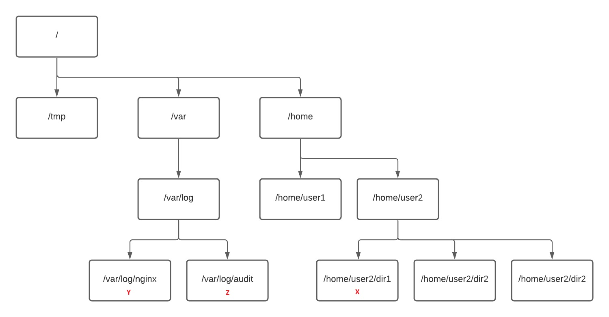

## Um pouco mais de teoria

>**_Diretório home_** de um usuário é o diretório que o usuário ganha ao ter sua conta criada no sistema. Normalmente `/home/nome-do-usuário`{{}}.

>No Linux há um usuário chamado **root**, que é o administrador do sistema. Seu _diretório home_ é o `/root`{{}}

Digite o comando abaixo (sem se preocupar com seu significado agora) para ficarmos logado com o usuário _root_.

`exit`{{exec}}

O comando `cd`{{exec}} (sem argumento) nos leva ao _diretório home_ (do usuário logado, claro).

Vá para o _diretório home_ e em seguida confirme qual é com `pwd`{{exec}}.

Ok, agora vamos criar mais um diretório:

`mkdir root`{{exec}}

Criamos o diretório root. Agora vamos para ele:

`cd root`{{exec}}

Veja onde estamos:

`pwd`{{exec}}

Temos essa estrutura: _/root/root_.

Ok, agora vamos voltar:

`cd ..`{{exec}}

Agora, vamos fazer quase a mesma coisa:

`cd /root`{{exec}}

Onde estamos agora?

`pwd`{{exec}}

Qual é a diferença? Obviamente, você percebeu o caractere `/`{{}}. O que isso tudo significa?

Nos sistemas de arquivos do Linux (ou melhor, em qualquer sistema _Linux-like_), o _root_ (a "primeira referência") é o diretório **raiz**. Esse diretório raiz é representado por `/`{{}}. Tudo o que está no nível mais alto do sistema de arquivos está no diretório /.

>Então nós temos:
>1. Um usuário _root_;
>2. O _diretório home_ do usuário _root_ que é _/root_; e
>3. A raiz do sistema de arquivos que se chama também _root_.

Vamos dar uma olhada na imagem abaixo.

Suponha que eu esteja no diretório **/home/user2/dir1** (_X_). Se eu quiser ir para o diretório **/var/log/nginx** (_Y_), posso fazer isso de duas maneiras:

- `cd ../../../var/log/nginx`{{}}
- `cd /var/log/nginx`{{}}

Qual é a diferença? Na segunda versão, estamos usando o caminho absoluto. Estamos referenciando nossa navegação pelos diretórios ao ponto principal do sistema - o _root_ (/). Quando colocamos `/`{{}} no início do caminho, isso informa ao sistema que estamos usando um caminho absoluto.

No primeiro exemplo, usamos um caminho relativo. Isso significa que estamos navegando a partir da nossa posição atual.

E agora, estando em **/var/log/nginx** (_Y_), como faríamos para chegar em **/var/log/audit** (_Z_) usando caminho relativo?

Tente fazer olhar a resposta

cd ../audit

 

Resumindo, ao digitar `cd /root`{{}} você estrará no diretório _root_ que se encontra na raiz do sistema de arquivos. Ao digitar `cd root`{{}} você entrará no diretório `root` que está dentro do diretório em você se encontra.
